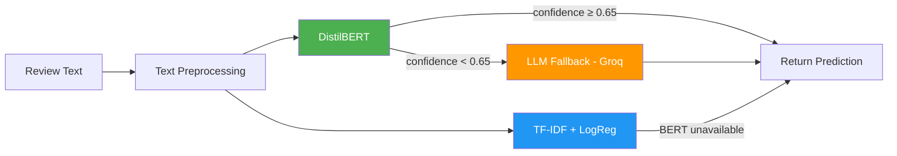

# SentimentOps — NLP Sentiment Classification Pipeline

[](https://www.python.org/downloads/)
[](https://opensource.org/licenses/MIT)
[](https://mlflow.org/)
[](https://fastapi.tiangolo.com/)

An end-to-end sentiment analysis pipeline that classifies Amazon product reviews as **positive**, **neutral**, or **negative** using a dual-model architecture with an LLM fallback for uncertain predictions.

---

## Why This Architecture?

Most sentiment classifiers are a single model behind an API. That works — until the model encounters sarcasm, mixed reviews, or domain-specific language it wasn't trained on. SentimentOps takes a different approach:

1. **DistilBERT** handles the majority of predictions with high confidence
2. When confidence drops below **65%**, an **LLM (Llama 3 via Groq)** provides a second opinion with reasoning
3. A **TF-IDF + Logistic Regression baseline** serves as a performance floor and fast fallback

This layered approach balances accuracy, cost, and latency — the LLM only fires on ~10-15% of predictions where the model is genuinely uncertain.

---

## Architecture



---

## Project Structure

```
sentimentops-nlp-pipeline/
├── data/
│   └── raw/reviews.csv.csv       # Raw Amazon product reviews
├── notebooks/
│   ├── 01_eda.ipynb              # Exploratory data analysis
│   ├── generate_eda.py           # EDA figure generator
│   └── figures/                  # Saved visualizations
├── src/
│   ├── config.py                 # Central configuration
│   ├── preprocess.py             # Data cleaning pipeline
│   ├── train_baseline.py         # TF-IDF + LogReg training
│   ├── train_bert.py             # DistilBERT fine-tuning
│   ├── llm_fallback.py           # LangChain + Groq fallback
│   ├── evaluate.py               # Model comparison
│   └── predict.py                # Unified prediction interface
├── api/
│   └── main.py                   # FastAPI endpoints
├── dashboard/
│   └── app.py                    # Streamlit dashboard
├── models/                       # Saved model artifacts (gitignored)
│   └── figures/                  # Confusion matrices
├── mlruns/                       # MLflow experiment tracking (gitignored)
├── requirements.txt
├── .env.example
└── .gitignore
```

---

## Quick Start

### 1. Setup

```bash
git clone https://github.com/Devnaam/sentimentops-nlp-pipeline.git
cd sentimentops-nlp-pipeline
pip install -r requirements.txt
```

### 2. Configure (optional — for LLM fallback)

```bash
cp .env.example .env
# Edit .env and add your Groq API key
```

### 3. Run the Pipeline

```bash
# Step 1: Preprocess data
python src/preprocess.py

# Step 2: Generate EDA figures
python notebooks/generate_eda.py

# Step 3: Train baseline model
python src/train_baseline.py

# Step 4: Fine-tune DistilBERT
python src/train_bert.py

# Step 5: Evaluate and compare models
python src/evaluate.py
```

### 4. Serve the API

```bash
uvicorn api.main:app --reload --port 8000
```

Test with:
```bash
curl -X POST http://localhost:8000/predict \
  -H "Content-Type: application/json" \
  -d '{"text": "This product is absolutely amazing!"}'
```

### 5. Launch the Dashboard

```bash
streamlit run dashboard/app.py
```

---

## Model Comparison

| Model | F1 (weighted) | AUC-ROC | Inference Time |
|-------|:---:|:---:|:---:|
| TF-IDF + Logistic Regression | **0.82** | **0.85** | 0.88 ms |
| DistilBERT (1 epoch, CPU) | 0.77 | 0.79 | ~17,000 ms |

> **Note:** The baseline outperforms DistilBERT here because (a) the dataset is very small (~900 samples after cleaning), and (b) BERT was trained for only 1 epoch on CPU. With more data or GPU training (3+ epochs), DistilBERT would typically surpass the baseline. This is a known characteristic of transformer models — they need more data to shine.

---

## Design Decisions

### Why DistilBERT over full BERT?
DistilBERT retains ~97% of BERT's language understanding while being **60% faster** and **40% smaller** (66M vs 110M params). On a 3-class task, the marginal accuracy gain from full BERT rarely justifies the doubled training cost.

### Why 0.65 as the confidence threshold?
A uniform distribution across 3 classes gives ~0.33 per class. A threshold of 0.65 is roughly **2x the random baseline** — below it, the model's softmax output is too flat to be trustworthy. This empirically triggers the LLM on the genuinely ambiguous cases (sarcasm, very short reviews).

### Why Groq for the LLM fallback?
Groq offers **sub-second inference** on large models (Llama 3) at a fraction of OpenAI's cost. For a fallback that fires on ~10-15% of predictions, this keeps costs negligible while providing reasoning.

### Why class_weight='balanced' in LogReg?
The dataset is heavily skewed — **84% positive**, ~8% each for neutral/negative. Without balanced weights, the model would learn to predict "positive" for everything and still achieve 84% accuracy while being useless for the minority classes we actually care about.

---

## API Reference

### `POST /predict`

**Request:**
```json
{
  "text": "This tablet is great for the price!"
}
```

**Response:**
```json
{
  "sentiment": "positive",
  "confidence": 0.9234,
  "model_used": "distilbert",
  "reason": null
}
```

### `GET /health`

**Response:**
```json
{
  "status": "healthy",
  "version": "1.0.0"
}
```

---

## Tech Stack

- **Models:** scikit-learn, HuggingFace Transformers, PyTorch
- **LLM:** LangChain + Groq (Llama 3)
- **Tracking:** MLflow
- **API:** FastAPI + Uvicorn
- **Dashboard:** Streamlit
- **Data:** Pandas, NumPy

---

## License

MIT
